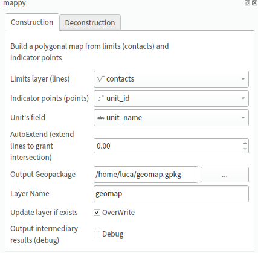

# mappy

This repo contains python code to generate maps starting from boundary lines and indicator points. The inverse operation is also supported.

The mappy library can be used as a standalone module for applying the transforms from python code (without QGIS).

The qgis_plugin folder contains qgismappy, a QGIS plugin that implements the GUI for the mappy python module.

**This module and plugin are experimental, please use the issue system to provide feedback**

# Requirements
The mappy python modul;e (and the QGIS plugin) makes use of several additional libraries, that must be installed opf the plugin will not work properly:

 - geopandas
 - topojson
 
# Install

## a) [suggested] From standalone package
This repo also provides pregenerated zip packages that can be installed in qgis by using the plugin manager.
Download it from [Releases](https://github.com/planmap-eu/mappy/releases) and install using the plugin manager


## b) From repo in development mode

To install the plugin clone this repo in a dedicated user folder:

```bash
git clone https://github.com/planmap-eu/mappy.git mappy.git
```
 
 and add the following system variable to your bashrc:

```bash
 QGIS_PLUGINPATH=/path_to_folder/mappy.git/qgis_plugin/
```

 or directly define `QGIS_PLUGINPATH` through `QGIS > Preferences > Environment`.
 
In this way QGIS should be able to find the plugin (activate it from the plugin manager of QGIS)


## How to use

- Ensure the plugin was correctly loaded and activated from Plugins -> Manage ...
- Open the plugin interface via Plugins->mappy->Mappy
- Load some data, for example you can use the data in the repository folder "input_data": load contacts and unit_id (just drag and drop the two folders in QGIS)
- You can now execute the "construction" of the map:



- Select the two layers to use (only layers of the right type can be selected)
- Remember to select a field to use as unit's name (or any field that can be used as identifier)
- Run Compute at the bottom of the plugin

## Using as a standalone module
The mappy module can be used as a standalone module in your python script (of course mappy need to be in the PYTHONPATH of your  python intepreter, or installed via pip):

Have a look at the examples folder with an example of processing


This module and QGIS plugin are used to perform the following transform, and vice-versa:


## Troubleshooting

### Can't load plugin 'qgismappy'

* `ModuleNotFoundError`: some of the dependencies are not installed. Mappy uses, for instance, as of this writting _geopandas_ and _ topojson_ which must be accessible/installed to the Python binary QGIS is using. On linux, QGIS uses the Python interpreter found on system/users environment. On MacOS, for instance, the (Python) interpreter is shipped together with QGIS.
  On MacOS, QGIS 3.14, Python is at `/Applications/QGIS3.14.app/Contents/Frameworks/Python.framework/Versions/Current/bin/`, so to install the dependencies we would do:
  ```bash
  /Applications/QGIS3.14.app/Contents/Frameworks/Python.framework/Versions/Current/bin/python3 -m pip install geopandas topojson
  ```
  
