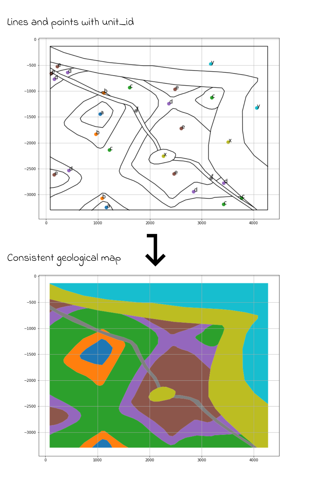

# mappy

This repo contains python code to generate maps starting from boundary lines and indicator points. The inverse operation is also supported.

The mappy library can be used as a standalone module for applying the transforms from python code (without QGIS).

The qgis_plugin folder contains qgismappy, a QGIS plugin that implements the GUI for the mappy python module.

**This module and plugin are experimental, please use the issue system to provide feedback**

# Requirements
The mappy python modul;e (and the QGIS plugin) makes use of several additional libraries, that must be installed opf the plugin will not work properly:

 - geopandas
 - topojson
 
# Install

## a) From repo in development mode

To install the plugin clone this repo in a dedicated user folder:

```bash
git clone https://github.com/planmap-eu/mappy.git mappy.git
```
 
 and add the following system variable to your bashrc:

```bash
 QGIS_PLUGINPATH=/path_to_folder/mappy.git/qgis_plugin/
```

In this way QGIS should be able to find the plugin (activate it from the plugin manager of QGIS)

## b) From standalone package
This repo also provides pregenerated zip packages that can be installed in qgis by using the plugin manager.
Download it from [Releases](https://github.com/planmap-eu/mappy/releases) and install using the plugin manager

This module and QGIS plugin are used to perform the following transform, and vice-versa:


